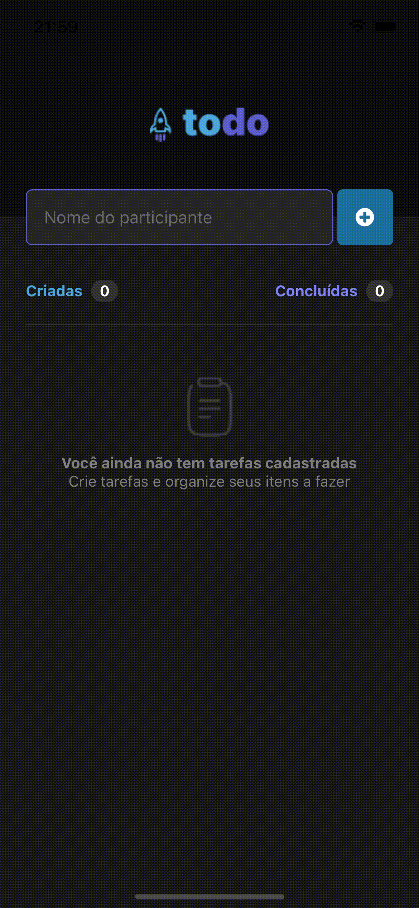

# study-todo-mobile

This is a study project of a mobile application for creating todo list

## 📘 Tech Stack

**Server:**

- React Native
- TypeScript
- Expo

## ⭐ Installation

Install my-project with npm

```bash
  yarn install
  yarn run start
  yarn run  ios
```

## 📸 Screns

<p align="left">
  
</p>
